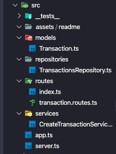

<div align="center">
  

</div>

<h2 align="center">
   Challenge 04: First NodeJS Project
</h2>

<h3 align="center">
  
</h3>

<!-- <table align="center">
  <tr >
    <td>
      &nbsp;&nbsp;&nbsp;&nbsp;&nbsp;&nbsp;&nbsp;&nbsp;&nbsp;&nbsp;&nbsp;&nbsp;
    </td>
    <td valign="center" >
      <span>Texte</span>
    </td>
  </tr>
</table> -->

<p align="center">

  

  

  

  

  

  <a href="https://www.codacy.com/manual/Fred-Reis/challenge_backEnd-04_GoStack-v2?utm_source=github.com&amp;utm_medium=referral&amp;utm_content=Fred-Reis/challenge_backEnd-04_GoStack-v2&amp;utm_campaign=Badge_Grade">
    </a>

  <!-- <a href="https://app.netlify.com/sites/affectionate-mahavira-913f7b/deploys">
    </a> -->

</p>

<blockquote align="center">
  This project be a part of bootcamp:
    <a href="https://rocketseat.com.br/gostack">
      GoStack by RocketSeat
    </a>
</blockquote>

<hr/>

<h4 align="center">Links:</h4>

<p align="center">

  <a href="#-about-challenge">
    
  </a>&nbsp;&nbsp;
  <a href="#-architecture">
    
  </a>&nbsp;&nbsp;
  <a href="#-functionalities">
    
  </a>&nbsp;&nbsp;
  <a href="-techs">
    
  </a>&nbsp;&nbsp;
  <a href="#-tools">
    
  </a>&nbsp;&nbsp;
  <a href="#-run-this-project">
    
  </a>&nbsp;&nbsp;
  <a href="#author-frederico-reis">
    
  </a>

</p>

## 💡 About Challenge:

In this challenge, construction began on the API that will serve as a front-end server and mobile application in the future.

Some concepts of SOLID and software architecture were applied.

## 📐 Architecture:

In this project, two routes were created divided into a project structure that
removes all liability from the route file, such as business rules and data validation. A structure with models, repositories and services was used to divide the tasks.

Folder's structure:



## 🔥 Functionalities:

- `POST /transactions`: This route receive `title`, `value` and `type` in the request body, being the `type` of transaction, which must be "income" for incoming (deposits) and "outcome" for outgoing (withdrawal). When registering a new transaction, it must be stored inside an object with the format as follows:

```js
{
  "id": "uuid",
  "title": "Salário",
  "value": 3000,
  "type": "income"
}
```

- `GET /transactions`: This route should return a list of all the transactions you have registered so far, together with the sum of the entries, withdrawals and total credit. This route must return an object with the following format:

```js
{
  "transactions": [
    {
      "id": "uuid",
      "title": "Salário",
      "value": 4000,
      "type": "income"
    },
    {
      "id": "uuid",
      "title": "Freela",
      "value": 2000,
      "type": "income"
    },
    {
      "id": "uuid",
      "title": "Pagamento da fatura",
      "value": 4000,
      "type": "outcome"
    },
    {
      "id": "uuid",
      "title": "Cadeira Gamer",
      "value": 1200,
      "type": "outcome"
    }
  ],
  "balance": {
    "income": 6000,
    "outcome": 5200,
    "total": 800
  }
}
```

## ⚙️ Techs:

- **NodeJS**;
- EsLint;
- Prettier;
- Express;
- Nodemon;
- Yarn;
- Jest;

## ⛏ Tools:

- [Insomnia](https://insomnia.rest/download/);
- [Notion](https://www.notion.so/?utm_source=google&utm_campaign=brand_alpha&utm_content=row&utm_term=notion&gclid=CjwKCAjw1cX0BRBmEiwAy9tKHs5ggnFG4dmfW38kOuGDTQS1-YjRGg01PuIriv8ftUuAUzeoU7QFFxoCAkIQAvD_BwE);

## 🏁 Run this project:

To run on the first time,
into your folder:

```bash
$ git clone https://github.com/Fred-Reis/challenge_backEnd-04_GoStack-v2
```

Into repo folder, to install `Node_Modules` run:

```bash
yarn
```

And to start the server:

```bash
yarn dev:server
```

> Recommend using [Insomnia](https://insomnia.rest/download/) to test routes

#### [For more details on the list of requirements and tests for this challenge.](https://github.com/Rocketseat/bootcamp-gostack-desafios/tree/master/desafio-fundamentos-nodejs)

😃 Now run this project and...
**BE HAPPY**.

<h4>
  😍 Thanks for you interest!
</h4>

<br/>

<h4 align="center">
  "Stay hungry stay foolish!"
</h4>

<br/>

---

<h3 align="center">
Author: <a alt="Fred-Reis" href="https://github.com/Fred-Reis">Frederico Reis</a>
</h3>

<p align="center">

  <a alt="Frederico Reis" href="https://www.linkedin.com/in/frederico-reis-dev/">
    </a>
  <a alt="Frederico Reis" href="https://github.com/Fred-Reis ">
  </a>

</p>
